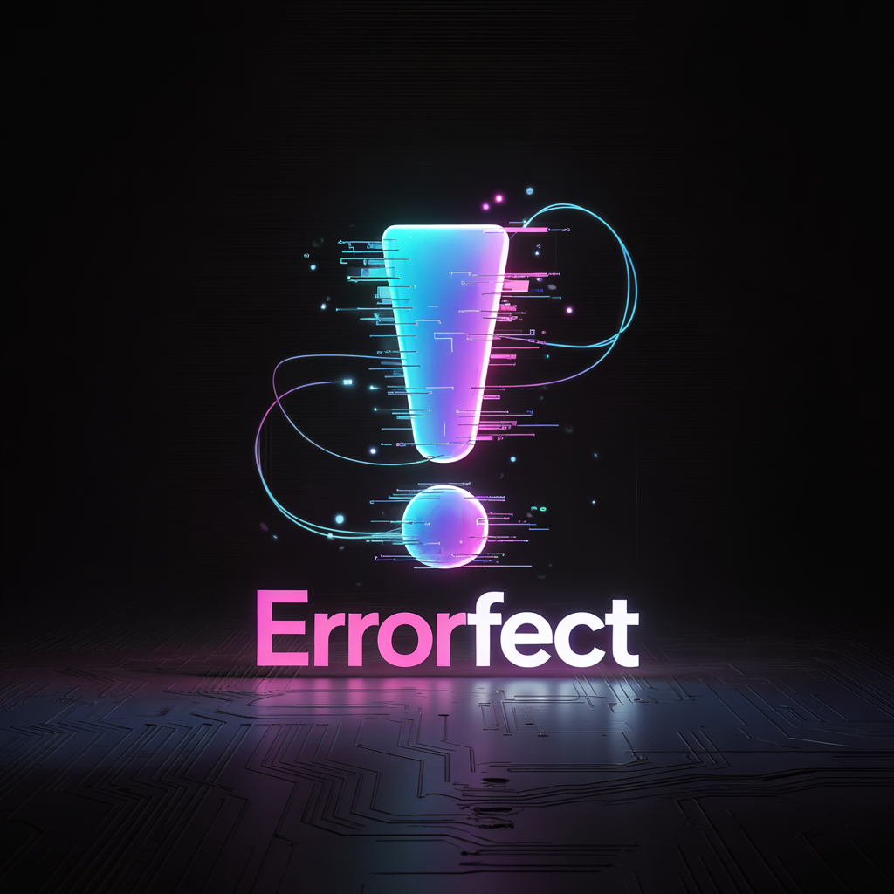

errorfect.com
<!DOCTYPE html>
<html lang="en">
<head>
  <meta charset="UTF-8" />
  <meta name="viewport" content="width=device-width, initial-scale=1.0" />
  <title>Errorfect - The Linguistic Autopsy</title>
  
</head>

<body>
  

    

      

        Perfect ERRORFECT
      

    

    

      Removing the first letter reveals the mechanism hiding inside the concept; the “mask” isn’t decoration — it’s social acceptability engineered into language.
    

    
↓

  

  <section>
    <h2>The Discovery</h2>
    

      

        We use words like <strong>perfect</strong>, <strong>normal</strong>, and <strong>control</strong> as if they describe reality. They rarely do.
        They behave more like cognitive operators: they compress ambiguity, create ranking, and assign blame without announcing they’ve done it.
      

      

        In Errorfect, the first letter functions as <strong>linguistic camouflage</strong>. Remove it and the machinery becomes visible — which matters because visibility is the prerequisite for choice.
      

    

    

      The mask isn’t part of the truth; it’s what makes the mechanism socially wearable.
    

  </section>

  <section>
    <h2>The Autopsy</h2>
    

      

        

          Perfect
        

        

          → Er(ror)fect
        

        

          “Perfect” smuggles in a hidden standard; then it quietly charges interest when you can’t pay it.
          Seen cleanly: perfectionism is an <strong>error-producing loop</strong> — not excellence. The pursuit becomes the mistake.
        

      

      

        

          Normal
        

        

          → Or Mal (or bad)
        

        

          “Normal” manufactures a center and then declares the edges defective.
          Mechanism: <strong>social comparison + exclusion</strong>. It isn’t a measurement term; it’s a sorting term.
        

      

      

        

          Control
        

        

          → On Trol(l)
        

        

          “Control” implies stable command over unstable systems; reality laughs and you pay the anxiety tax.
          Mechanism: <strong>threat response management</strong> disguised as mastery.
        

      

    

  </section>

  <!-- NEW: Use-cases + mental/therapeutic framing -->
  <section>
    <h2>Use Cases: Mental, Personal, Therapeutic</h2>

    

      

        Errorfect is a language-based intervention: not a diagnosis tool, not a moral philosophy, not a vibe.
        It’s a repeatable method for metacognitive de-fusion — separating you from the spell a word is casting so you can decide what you actually mean.
      

      

        Clinically adjacent terms (used here in their standard meanings): <strong>cognitive reframing</strong> (CBT),
        <strong>cognitive defusion</strong> (ACT),
        <strong>externalization</strong> (narrative therapy),
        <strong>shame resilience</strong>,
        <strong>perfectionism reversal</strong>,
        and <strong>locus-of-control calibration</strong>.
      

    

    

      

        

          Perfectionism reversal
        

        

          CBT: cognitive distortions
          ACT: defusion
          Self-compassion
          

            <strong>When it hits:</strong> “This must be perfect.” 
            <strong>Run Errorfect:</strong> “Perfect” → “Errorfect.” 
            <strong>Translate:</strong> “A hidden standard is attacking me.” 
            <strong>Replace with a usable target:</strong> “Functional,” “clear,” “safe,” “version 1,” “good-enough-for-now.” 
            <strong>Therapeutic payoff:</strong> reduces shame spirals, procrastination, and compulsive checking by collapsing the false binary (perfect vs failure).
          

        

      

      

        

          Norm pressure detox
        

        

          Social comparison
          Minority stress lens
          Boundary clarity
          

            <strong>When it hits:</strong> “Be normal.” / “That’s not normal.” 
            <strong>Run the autopsy:</strong> “Normal” → “or mal.” 
            <strong>Translate:</strong> “A sorting rule is being enforced.” 
            <strong>Ask the only question that matters:</strong> “Normal for whom, in what context, by what metric?” 
            <strong>Therapeutic payoff:</strong> restores agency; converts vague social coercion into a debatable claim with missing measurement.
          

        

      

      

        

          Control-anxiety calibration
        

        

          Threat response
          Uncertainty tolerance
          Locus of control
          

            <strong>When it hits:</strong> “I must control this.” 
            <strong>Run the autopsy:</strong> “Control” → “on troll.” 
            <strong>Translate:</strong> “I’m trying to command a complex system from fear.” 
            <strong>Swap ‘control’ → ‘influence’:</strong> identify one lever you can pull now; release the rest. 
            <strong>Therapeutic payoff:</strong> reduces hypervigilance; replaces impossible total command with tractable influence.
          

        

      

      

        

          Shame externalization (fast)
        

        

          Narrative therapy
          De-shaming
          Identity separation
          

            <strong>Move:</strong> treat the word as the actor, not you. 
            <strong>Example:</strong> “Perfect is attacking me” (not “I’m failing”). 
            <strong>Then:</strong> name the mechanism (“standard injection,” “sorting,” “threat-response”). 
            <strong>Therapeutic payoff:</strong> interrupts identity fusion (“I am broken”) by relocating the problem to a linguistic device.
          

        

      

      

        

          Relationship repair language
        

        

          Nonviolent communication adjacent
          De-escalation
          Precision requests
          

            <strong>Spot it:</strong> “You always…” “Be normal…” “Just control yourself…” 
            <strong>Convert the spell into data:</strong> ask for the observable behavior + timeframe. 
            <strong>Replace absolutes:</strong> “always/never” → “often/this week/last time.” 
            <strong>Therapeutic payoff:</strong> reduces conflict driven by vague global judgments; turns accusations into actionable specifics.
          

        

      

      

        

          Creative / artistic self-permission
        

        

          Process orientation
          Flow protection
          Iteration
          

            <strong>Reframe:</strong> error isn’t a failure-state; it’s the engine-state. 
            <strong>Rename drafts:</strong> “prototype,” “field test,” “trial form.” 
            <strong>Therapeutic payoff:</strong> keeps the nervous system out of courtroom mode so the work can actually happen.
          

        

      

    

    

      Errorfect is a measurement move: it turns “vibes with authority” into claims that require a metric — and most coercive words evaporate when asked to show their units.
    

    

      

        A clean caution: this is not a substitute for professional care when someone is in crisis, dissociation, or severe mood instability.
        Used responsibly, it’s a precision tool for day-to-day cognition: defusing loaded language, reducing shame fuel, and restoring choice at the exact moment a word tries to seize the steering wheel.
      

    

  </section>

  <section>
    <h2>Visual Evidence</h2>
    

      

        
        

          The glitching isn’t aesthetic — it’s the mechanism breaking down, the error generating itself.
        

      

      

        
        

          The burning P and N: arrows destroying the masks — iconoclasm aimed at false authority.
        

      

    

  </section>

  <section>
    <h2>The Implications</h2>
    

      

        When someone says “perfection is here,” they may be activating an error-generating machine.
        The packaging can be spiritual, corporate, parental, romantic — the machinery stays the same: a hidden metric that produces inadequacy.
      

      

        These words function like incantations. They work because we don’t see the mechanism.
        The <strong>P</strong> in perfect, the <strong>N</strong> in normal, the <strong>C</strong> in control — not just letters: masks that make coercion aspirational.
      

      

        This isn’t about “using the words incorrectly.” Often the words <em>are</em> the incorrectness: a mechanism pretending to be a description.
      

    

    

      See the word without the mask; reclaim the steering wheel.
    

  </section>

  <section>
    <h2>The Inversion</h2>
    

      

        Once you understand the mechanism, you can use it in <strong>reverse</strong>.
      

      

        Instead of stripping masks to reveal damage, you can build names whose surface and substrate agree —
        where removing the mask doesn’t expose shame; it exposes the same intent, just more plainly.
      

    

    

      If stripping the name reveals hope instead of harm, 
      the “mask” loses its power — both versions remain true.
    

    

      

        <h3 style="color: #ff006e; margin-bottom: 1.5rem;">The Given Name</h3>
        

          Briar
          Morgan
          Greenway
        

        

          → Riar Organ Reenway
        

        

          Beautiful surface (protected, rooted, moving forward) 
          Hidden mechanism: <strong>wreckage, biological function, endless cycles</strong>
        

      

      

        <h3 style="color: #00f5ff; margin-bottom: 1.5rem;">The Chosen Name</h3>
        

          Axel
          Twin
          Avalue
        

        

          → xel win value
        

        

          Intentional surface (pivot, mirroring, possessing worth) 
          Hidden mechanism: <strong>excel, victory, value</strong>
        

      

    

    

      

        <strong>Axel</strong> works whether you say it or strip it — you get “excel” either way.
        The first letter becomes cosmetic, not camouflage; excellence remains.
      

      

        <strong>Twin → win</strong>: doubling collapses into victory — repetition becomes outcome.
      

      

        <strong>Avalue → value</strong>: possession of worth reveals worth itself; the substrate isn’t damage, it’s treasure.
      

      

        This is the surgery in reverse: building language where the hidden layer reinforces life instead of undermining it.
      

    

  </section>

  <footer>
    
Errorfect © 2026 | A linguistic autopsy

    
The first letter is camouflage for what these concepts actually do

  </footer>

  
</body>
</html>
